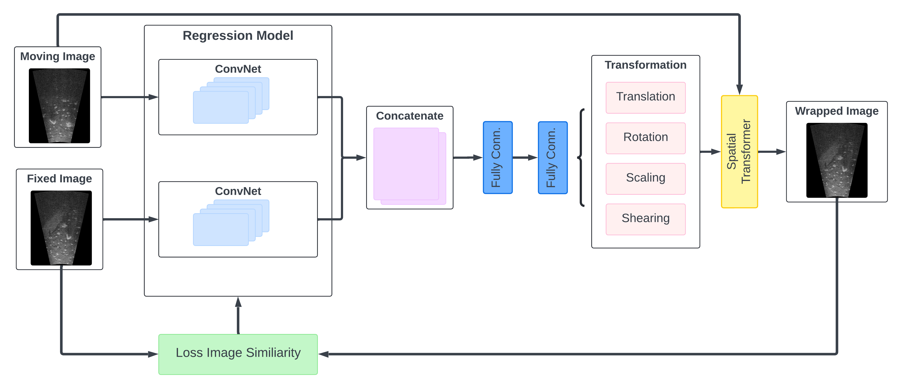
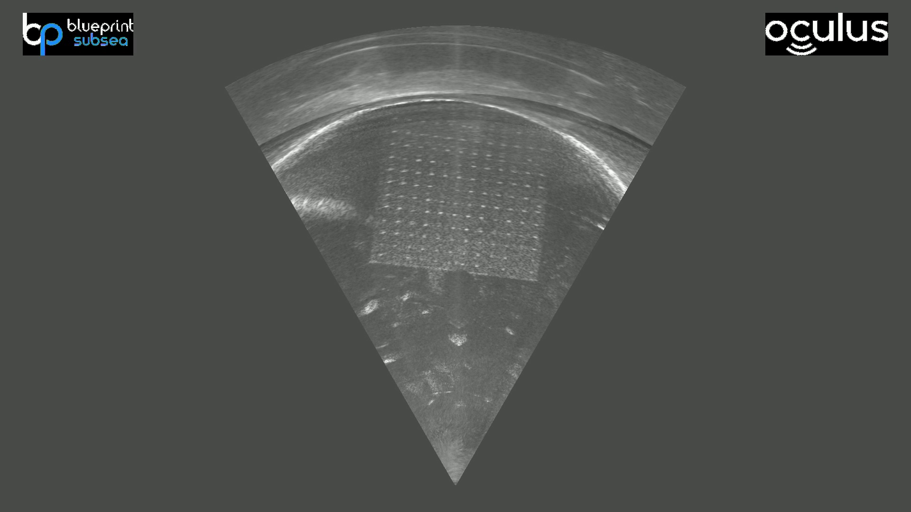
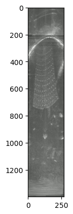

# End-to-End Unsupervised Learning for Sonar Image Registration
In this project, we analyze state-of-the-art unsupervised learning architecture of image registration techniques such as DLIRNet, which can be applied to perform registration on unseen image pairs in one pass. The neural network architecture obtain the parameters from different forms of ConvNet by inputting a pair of moving and fixed images. The output parameters (affine transformation) will be passed to a spatial transformer and a resampler which wraps the moving image to the fixed image. The performance will be evaluated by a similarity metric (NCC) between the wrapped and fixed images.

## Data
To train a neural network effectively, a substantial volume of datasets is indispensable. Specifically, our study necessitates a significant quantity of sonar image pairs. We have compiled tailored datasets designated for training, validation, and testing purposes. The data was acquired within a water tank environment by maneuvering a forward-looking sonar across a scene.

## Architecture
| | 
|:--:| 
| *Architecture* |
The figure above shows our architecture of the model. We replece the ConvNet to Incpection-v1 to encode 2 patches of images to extract spatial information. Then, flatten and concatenate the Inception output feature map and pass to fully connected layers that produce the 1 by 6 vector which is a predicted affine transformation parameters. Last, apply spatial transformation layer in our baseline which input moving and predicted affine parameters and wrapped the moving sonar image. 

The negative normalized cross-correlation (NCC) is chosen to train the network. The NCC measures the similarity between two images based on their intensity values. The negative NCC is often used as a loss function because optimization algorithms typically minimize a loss function to find the optimal transformation parameters for image registration.

## Image Preprocessing
To effectively train the image registration model, it is essential that the input images possess uniform width and height dimensions. To maximize the field of view offered by sonar images, we intend to retain the entire scope of the sonar image without cropping specific regions. This involves converting the recorded sonar images into Range-azimuth images. 

According to the sonar calibration, we have determined that the minimum bottom range in the original Oculus sonar image corresponds to the image coordinate (959, 1025). Additionally, the Range value at this coordinate is 971. Utilizing this contextual information, we can employ specific formulas to convert each pixel value within the image plane to its corresponding Range-azimuth representation.

The Range resolution of the Oculus sonar image is 0.0025 meters in 0 to 3.5 meters. The azimuth resolution is 0.25 degrees in -30 to 30 degrees. In sum, we can have a 1400 x 267 Range-azimuth image. The original Oculus sonar image and Range-Azimuth image is shown below.

Original |  Range-Azimuth 
:-------------------------:|:-------------------------:
  |   

## Usage

## Visualization & Performance

## Reference